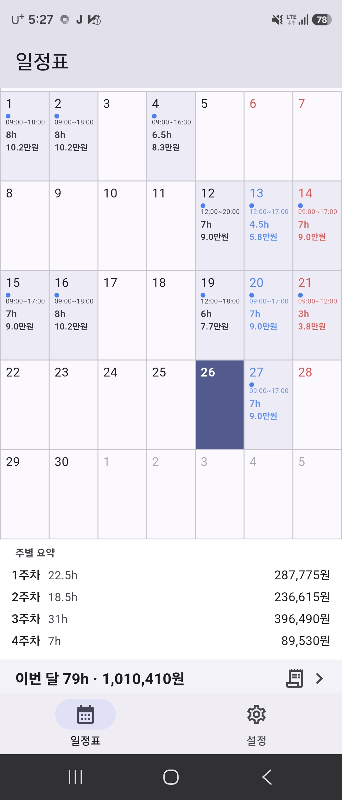
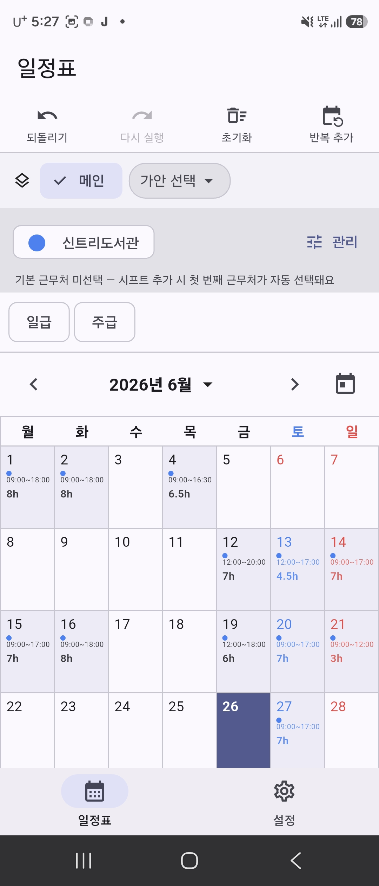
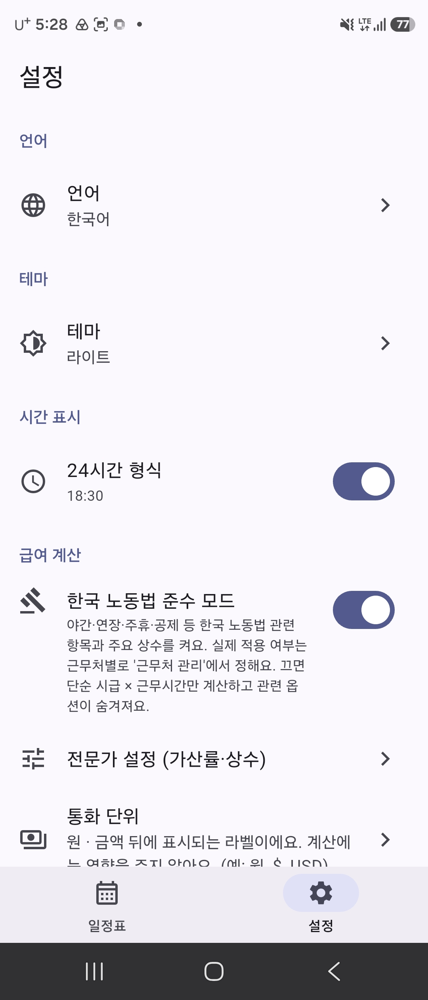
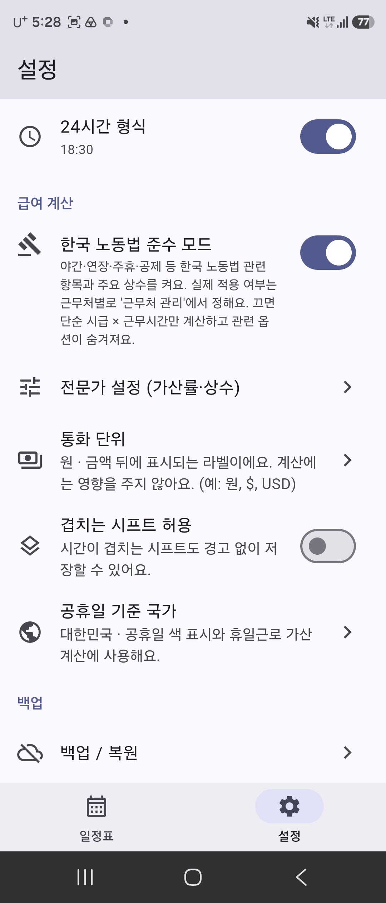

# salary_app

월급이 — 광고 없는 근무 일정·월급 계산 앱

## 스크린샷

| 월간 일정·월급 요약 | 시프트 편집·근무처 | 설정 | 급여 계산 옵션 |
| :---: | :---: | :---: | :---: |
|  |  |  |  |

## Getting Started

This project is a starting point for a Flutter application.

A few resources to get you started if this is your first Flutter project:

- [Learn Flutter](https://docs.flutter.dev/get-started/learn-flutter)
- [Write your first Flutter app](https://docs.flutter.dev/get-started/codelab)
- [Flutter learning resources](https://docs.flutter.dev/reference/learning-resources)

For help getting started with Flutter development, view the
[online documentation](https://docs.flutter.dev/), which offers tutorials,
samples, guidance on mobile development, and a full API reference.
